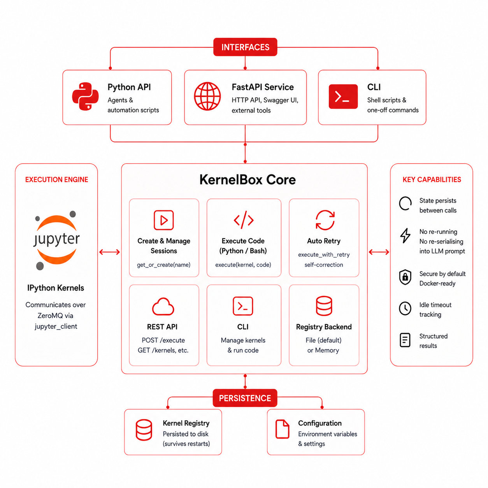

<p align="center">
  
</p>

<p align="center">
  
</p>

# KernelBox

**Persistent IPython kernels for agents, scripts, and tools — no notebook server required.**

KernelBox talks directly to IPython kernels over ZeroMQ through `jupyter_client`. It gives your agent a persistent Python session it can hold open, run code in, and read structured results from — without spinning up a full Jupyter server.

---

## The 30-second pitch

```python
from kernelbox import get_or_create, execute, destroy

kernel = get_or_create("demo")

# Step 1 — load data
execute(kernel, "numbers = [1, 2, 3, 4, 5]")

# Step 2 — the kernel still remembers `numbers`
result = execute(kernel, "sum(numbers)")
print(result.return_value)  # 15

destroy("demo")
```

State persists between calls. No re-running. No re-serialising into the LLM prompt.

---

## Pick your interface

| Interface | Best for |
| --- | --- |
| **Python API** | Writing agents or automation scripts |
| **FastAPI service** | HTTP endpoints, Swagger UI, external tools |
| **CLI** | Shell scripts, quick one-off commands |

---

## What it does

- **Creates and manages named kernel sessions** — `get_or_create("name")` returns a live kernel, creating it if needed.

- **Executes Python or Bash code** — `execute(kernel, code)` runs the code and returns a rich structured result.

- **Retries failing code automatically** — `execute_with_retry` calls your repair function after each failure so your agent can self-correct.

- **Exposes a full REST API** — the FastAPI server gives you `POST /sessions/{name}/execute`, `GET /kernels`, and more.

- **Works from the terminal** — the `kernelbox` CLI manages kernels and executes code with JSON output, easy to pipe into `jq`.

- **Persists kernel registry to disk** — the file backend survives server restarts; swap to memory backend for ephemeral use.

- **Runs securely in Docker** — the included `docker-compose.yml` uses a non-root user, read-only filesystem, and tmpfs scratch space.

---

## Assumptions & Current Limitations

!!! warning "Know these before going to production"

    These are known constraints in v0.1.0. Understanding them will help you deploy safely.

| Area | Behaviour in v0.1.0 |
| --- | --- |
| **Sandboxing** | Kernels run with the same OS privileges as the calling process. Use the included Docker setup for isolation. |
| **Authentication** | The FastAPI server has **no auth**. Bind to `127.0.0.1` or place behind a reverse proxy. |
| **Concurrency** | File registry is not safe for heavy concurrent writes from multiple processes. |
| **Idle kernel cleanup** | KernelBox tracks idle timeout in metadata but does **not** automatically kill idle kernels. |
| **Output truncation** | stdout/stderr is cut at `KERNELBOX_OUTPUT_CHAR_LIMIT` (default 10 000 chars). Check `result.truncated`. |
| **Bash execution** | Bash runs through IPython's `%%bash` magic — not a real shell. Path and env may differ. |
| **Windows ACL** | The Windows ACL restriction for Jupyter connection files is patched. Connection files may be world-readable. |
| **Kernel types** | Only the `python3` kernelspec is tested. Other kernelspecs may work but are unsupported. |

---

## Where to go next

| | |
| --- | --- |
| :material-rocket-launch: [**Setup**](setup.md) | Install and run for the first time |
| :material-language-python: [**Python API**](tutorials/python-api.md) | Full walkthrough with all return fields |
| :material-api: [**HTTP API**](tutorials/http-api.md) | curl examples and Swagger UI |
| :material-console: [**CLI**](tutorials/cli.md) | Terminal commands and JSON output |
| :material-cog: [**Configuration**](configuration.md) | All environment variables |
| :material-shield-lock: [**Security**](security.md) | Read before production |
